# RED-CMS 5.1 Add-On Platform Status

This map tracks the approved path from the reusable RED-CMS core to the first
separately distributed optional package. Green work is complete, blue is the
current slice, gray is still gated, and gold is the first package target.

```mermaid
flowchart TD
    O["Objective<br/>Adaptable lightweight core<br/>with isolated clients and databases"]
    O --> F1["Trust, manifest, install, lifecycle"]
    F1 --> F2["Runtime component and service registration"]
    F2 --> F3["Placement parent, editor schema, permissions, data loading"]
    F3 --> F4["Atomic update, immutable revisions, restore"]
    F4 --> F5["Inactive creation and parent metadata"]
    F5 --> F6["Display-only revision-history UI"]
    F6 --> F7["Read-only delete preflight"]
    F7 --> F8["Atomic delete runner"]
    F8 --> F9["Operational editor endpoint and form"]
    F9 --> F10["Read-only public-placement preflight"]
    F10 --> F11["Atomic public placement and activation"]
    F11 --> F12["Audited administrator placement control"]
    F12 --> F13["Typed internal service invocation"]
    F13 --> F14["Public GET route dispatch"]
    F14 --> F15["Read-only administrator-tool dispatch"]
    F15 --> F16["Typed setting values and secret references"]
    F16 --> F17["Settings storage and write preflight"]
    F17 --> F18["Atomic setting persistence"]
    F18 --> F19["Secret availability + authorized settings read model"]
    F19 --> F20["Namespaced CSS/JS asset plan"]
    F20 --> F21["Read-only immutable asset-delivery preflight"]
    F21 --> F22["Static immutable asset endpoint"]
    F22 --> C["Core-owned public/admin injection"]
    C --> A1["Administrator write-action preflight"]
    A1 --> A2["Atomic internal admin action runner"]
    A2 --> A3["Protected unlinked admin action endpoint"]
    A3 --> G4["Public-mutation contract"]
    G4 --> G5["Public-mutation declaration preflight"]
    G5 --> G6["Read-only public-mutation live-data preflight"]
    G6 --> G7["Core anonymous-subject + CSRF foundation"]
    G7 --> G8["Core fixed-window rate-limit foundation"]
    G8 --> G9["Core opaque idempotency-key foundation"]
    G9 --> G10["Core atomic transaction runner + replay ledger"]
    G10 --> G11["Core public-mutation HTTP envelope"]
    G11 --> G12["Core static mutation-route selector"]
    G12 --> G13["Core server request-facts adapter"]
    G13 --> G14["Core closed response emitter"]
    G14 --> G15["Core subject-cookie serialization"]
    G15 --> G16["Caddy/FrankenPHP ingress attestation"]
    G16 --> G17["CURRENT / NEXT<br/>Bounded HTTP dispatch + richer enablement"]
    G17 --> S["TARGET<br/>Store Lite optional package"]
    S -. later optional packages .-> E["Events Calendar"]
    E -.-> A["Appointments"]
    A -.-> D["Donations"]
    D -.-> R["Restaurant Ordering"]

    classDef complete fill:#e7f6ed,stroke:#27764a,color:#183d2a;
    classDef current fill:#e8f1ff,stroke:#2f6fc3,color:#173a68,stroke-width:3px;
    classDef remaining fill:#f3f5f7,stroke:#82909c,color:#34424d;
    classDef target fill:#fff3d6,stroke:#a36b00,color:#5e4100,stroke-width:3px;
    class F1,F2,F3,F4,F5,F6,F7,F8,F9,F10,F11,F12,F13,F14,F15,F16,F17,F18,F19,F20,F21,F22,C,A1,A2,A3,G4,G5,G6,G7,G8,G9,G10,G11,G12,G13,G14,G15,G16 complete;
    class G17 current;
    class E,A,D,R remaining;
    class S target;
```

| Checkpoint | Current answer |
| --- | --- |
| Product objective | Reusable core plus optional packages; never mix client installations, databases, add-on state, media, settings, or business data. |
| Latest completed slice | Optional Caddy/FrankenPHP ingress-attestation source and unlinked PHP verifier: it strips spoofed internal headers, signs only bounded candidate `/addons/` POST facts with a per-installation HMAC, and preserves ordinary downstream behavior. No custom binary, active Caddyfile, default server change, dispatcher, endpoint, browser issuance/rotation, Store Lite state, or enablement change exists. |
| Current milestone | Bounded public HTTP dispatch and richer-enablement gates: custom-binary deployment proof for the supported ingress contract, actual browser subject-cookie issuance/clearance/rotation, bounded dispatcher routing/containment, richer enablement, settings UI/endpoints, actual secret lookup, and Store Lite remain blocked. |
| First vertical target | Store Lite as an optional package, not a core component. |
| Later examples | Events Calendar, Appointments, Donations, and Restaurant Ordering; these are possibilities, not simultaneous core scope. |

A documentation-only planning checkpoint moves after its contract review and
repository integrity checks. An implementation checkpoint moves only after its
focused checks, the full disposable-database acceptance suite, and relevant
desktop/mobile administrator verification.
