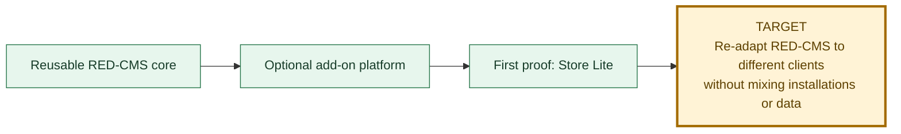

# RED-CMS 5.1 And Store Lite Progress

Last updated: 2026-08-09 after Store Lite Gate 2D2D2.

This is the canonical graphical status page for the current RED-CMS 5.1
objective. Green work is complete, blue is the active gate, gray remains
gated, and gold is the release target.

## Objective

The non-negotiable boundary is unchanged: each client keeps a separate RED-CMS
installation, database, add-on state, settings, secrets, media, and business
data. Store Lite is an optional package, never a core component or shared
client database.

## Store Lite launch path

```mermaid
flowchart TD
    A["COMPLETE<br/>A. Add-on platform foundation<br/>trust, lifecycle, runtime, permissions, transactions"]
    B["COMPLETE<br/>B. Product system<br/>simple products + bounded variants"]
    C["COMPLETE<br/>C. Catalog administration<br/>create, edit, save, permissions"]
    D["COMPLETE<br/>D. Public Product component<br/>homepage placement + responsive rendering"]
    E["COMPLETE<br/>E. Server-authoritative cart engine<br/>resolver + persistence"]
    F["COMPLETE<br/>Gate 2D1<br/>Store Lite bound to core atomic mutation runner"]
    G1["COMPLETE<br/>Gate 2D2A<br/>Core-owned accessible form model + escaped renderer"]
    G2["COMPLETE<br/>Gate 2D2B<br/>Store Lite product/variant field model"]
    G3["COMPLETE<br/>Gate 2D2C<br/>subject + CSRF + idempotency bootstrap"]
    G4A["COMPLETE<br/>Gate 2D2D1<br/>component mutation-presentation boundary"]
    G4B["COMPLETE<br/>Gate 2D2D2<br/>Store Lite Product binding + core form integration"]
    G4C["CURRENT — Gate 2D2D3<br/>browser controller + response ownership<br/>desktop/mobile QA"]
    H["NEXT<br/>Usable cart<br/>view, update quantity, remove line"]
    I["LATER FOR STORE LITE v1<br/>Guest order + immutable order snapshot<br/>pay-on-receipt first"]
    J["RELEASE GATE<br/>disable/re-enable, recovery, migration,<br/>responsive QA, client isolation"]
    K["TARGET<br/>Store Lite v1 usable on demo.red-sphere.com"]

    A --> B --> C --> D --> E --> F --> G1 --> G2 --> G3 --> G4A --> G4B --> G4C --> H --> I --> J --> K

    classDef complete fill:#e7f6ed,stroke:#27764a,color:#183d2a;
    classDef current fill:#e8f1ff,stroke:#2f6fc3,color:#173a68,stroke-width:3px;
    classDef remaining fill:#f3f5f7,stroke:#82909c,color:#34424d;
    classDef target fill:#fff3d6,stroke:#a36b00,color:#5e4100,stroke-width:3px;
    class A,B,C,D,E,F,G1,G2,G3,G4A,G4B complete;
    class G4C current;
    class H,I,J remaining;
    class K target;
```

## Current phase

| Question | Current answer |
| --- | --- |
| Where are we? | Gate 2D2D3: connect the completed core form integration to a core-owned browser fetch controller and supported-server response boundary, then prove the real Product interaction at desktop and mobile sizes. |
| What just finished? | Gate 2D2D2. Store Lite 0.1.16 now attaches a data-only presentation to sellable Products, and core verifies runtime ownership before returning escaped form markup plus same-subject evidence lifecycle without invoking package callbacks or emitting response state. |
| What can the demo do today? | Administrators can create/edit products and place a Product component on the homepage. Public visitors can see the product. The internal cart write works in rehearsal, but there is no public Add-to-cart control yet. |
| What remains inside Gate 2D2? | Browser fetch controller, supported-server request dispatch, generic success/refusal output, no-store response/cookie ownership, and desktop/mobile mutation proof. |
| What remains after Gate 2D2? | A visible editable cart, minimum guest order/pay-on-receipt flow, then lifecycle/recovery/migration/isolation release acceptance. |
| What is intentionally outside this target? | Hosted payment adapters and Events Calendar, Appointments, Donations, and Restaurant Ordering. Those remain separate later packages or gates. |

## Status rule

A gate moves to complete only after its contract, focused checks, disposable
database proof, relevant desktop/mobile browser inspection, configured-primary
isolation, exact cleanup, documentation, and reviewed commit are all recorded.
