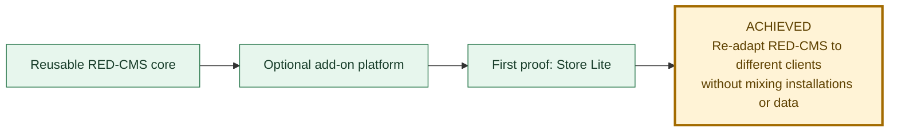
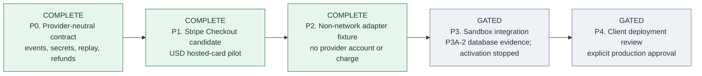

# RED-CMS 5.1 And Store Lite Progress

Last updated: 2026-08-15 after the isolated hosted demo deployment, public and
administrator verification, responsive checkout inspection, RED-CMS 5.1 Basic
instruction closeout, full RED-CMS 5.1.0 acceptance, and the published
`v5.1.0` release.

This is the canonical graphical status page for the current RED-CMS 5.1
objective. Green work is complete, blue is the active gate, gray remains
gated, and gold marks an achieved release target.

## Objective

The non-negotiable boundary is unchanged: each client keeps a separate RED-CMS
installation, database, add-on state, settings, secrets, media, and business
data. Store Lite is an optional package, never a core component or shared
client database.

## Store Lite launch path

```mermaid
flowchart TD
    A["COMPLETE<br/>A. Add-on platform foundation<br/>trust, lifecycle, runtime, permissions, transactions"]
    B["COMPLETE<br/>B. Product system<br/>simple products + bounded variants"]
    C["COMPLETE<br/>C. Catalog administration<br/>create, edit, save, permissions"]
    D["COMPLETE<br/>D. Public Product component<br/>homepage placement + responsive rendering"]
    E["COMPLETE<br/>E. Server-authoritative cart engine<br/>resolver + persistence"]
    F["COMPLETE<br/>Gate 2D1<br/>Store Lite bound to core atomic mutation runner"]
    G1["COMPLETE<br/>Gate 2D2A<br/>Core-owned accessible form model + escaped renderer"]
    G2["COMPLETE<br/>Gate 2D2B<br/>Store Lite product/variant field model"]
    G3["COMPLETE<br/>Gate 2D2C<br/>subject + CSRF + idempotency bootstrap"]
    G4A["COMPLETE<br/>Gate 2D2D1<br/>component mutation-presentation boundary"]
    G4B["COMPLETE<br/>Gate 2D2D2<br/>Store Lite Product binding + core form integration"]
    G4C1["COMPLETE<br/>Gate 2D2D3A<br/>unlinked browser controller"]
    G4C2["COMPLETE<br/>Gate 2D2D3B<br/>response/cookie ownership + endpoint wiring"]
    G4C3["COMPLETE — Gate 2D2D3C<br/>real Store Lite desktop/mobile mutation QA"]
    H1["COMPLETE<br/>Read-only Cart component<br/>empty + current subject lines"]
    H2A["COMPLETE<br/>Editable Cart A<br/>Store Lite quantity/remove data models"]
    H2B["COMPLETE<br/>Editable Cart B<br/>core bounded row-form retention"]
    H2C["COMPLETE<br/>Editable Cart C<br/>read-model binding + core composition"]
    H2D["COMPLETE<br/>Editable Cart D<br/>desktop/mobile mutation QA"]
    I1["COMPLETE<br/>Guest order foundation<br/>immutable server-derived snapshot"]
    I2["COMPLETE<br/>Store Lite 0.1.27<br/>guest-checkout scalar + presentation contract"]
    I3["COMPLETE<br/>Generic runtime-settings boundary<br/>declared non-secret handler configuration"]
    I4["COMPLETE<br/>Store Lite 0.1.28 guest checkout<br/>orders + pay on receipt + browser QA"]
    J1["COMPLETE — Release A<br/>read-only operational-package evidence"]
    J2["COMPLETE — Release B<br/>atomic enable + disable/re-enable"]
    J3A["COMPLETE — Release C1<br/>generic upgrade + failure recovery"]
    J3B["COMPLETE — Release C2<br/>real Store Lite 0.1.28 → 0.1.29 migration"]
    J3C["COMPLETE — Release C3<br/>responsive QA + configured-primary<br/>and two-client isolation"]
    K1["COMPLETE<br/>shared-host direct-PHP ingress adapter"]
    K2["COMPLETE<br/>real Apache/FastCGI proof + deployment review"]
    K3["COMPLETE<br/>basic demo deployment"]
    L["ACHIEVED<br/>Store Lite v1 usable on demo.red-sphere.com"]

    A --> B --> C --> D --> E --> F --> G1 --> G2 --> G3 --> G4A --> G4B --> G4C1 --> G4C2 --> G4C3 --> H1 --> H2A --> H2B --> H2C --> H2D --> I1 --> I2 --> I3 --> I4 --> J1 --> J2 --> J3A --> J3B --> J3C --> K1 --> K2 --> K3 --> L

    classDef complete fill:#e7f6ed,stroke:#27764a,color:#183d2a;
    classDef target fill:#fff3d6,stroke:#a36b00,color:#5e4100,stroke-width:3px;
    class A,B,C,D,E,F,G1,G2,G3,G4A,G4B,G4C1,G4C2,G4C3,H1,H2A,H2B,H2C,H2D,I1,I2,I3,I4,J1,J2,J3A,J3B,J3C,K1,K2,K3 complete;
    class L target;
```

## Current phase

| Question | Current answer |
| --- | --- |
| Where are we? | The Store Lite v1 basic-demo target is achieved. Release C3, the direct-PHP adapter, hosted Store Lite 0.1.31 deployment, responsive public verification, and RED-CMS 5.1 Basic instructions are complete. |
| What just finished? | The hosted demo exposes nine products, the exact nine-choice Size/Color scarf, Product and Cart authoring, Products and Orders tools, an empty/current cart, pickup and delivery checkout, and pay on receipt. RED-CMS 5.1.0 and the clean-core Instructions boundary are visible in the authenticated workspace. |
| What is active now? | No required gate remains inside the Store Lite v1 basic-demo target. RED-CMS 5.1.0 is formally released; Payment Adapter Gates P0 and P1 are complete. The first candidate is Stripe Checkout for a provisional USD hosted-card pilot. The no-network fixture and sandbox integration remain separately approved gates. |
| What can the demo do today? | Administrators can create/edit products, place Product and Cart components, and review Products and Orders tools. Public visitors can add, update, and remove simple or bounded-variable products, then use the guest-checkout form with pickup or delivery and pay on receipt. |
| What remains inside Gate 2D2? | Nothing. Gate 2D2 is closed by the supported-server Store Lite browser evidence. |
| What remains after this gate? | Nothing required for the basic-demo target. Hosted PayPal/card adapters remain later provider-neutral work and are not implied by this closeout. |
| What is intentionally outside this target? | Hosted payment adapters and Events Calendar, Appointments, Donations, and Restaurant Ordering. Those remain separate later packages or gates. |

The hosted closeout evidence and explicit no-order-submission limitation are
recorded in
[`STORE-LITE-DEMO-CLOSEOUT-20260815.md`](STORE-LITE-DEMO-CLOSEOUT-20260815.md).

## Optional payment-adapter path

Gates P0 through P2 define no credentials, webhook, checkout, charge, order
change, package, or database. P2 is a CLI-only contract fixture, not a payment
integration. Read the provider-neutral contract in
[`PAYMENT-ADAPTER-DIRECTION.md`](PAYMENT-ADAPTER-DIRECTION.md) and the
reversible USD pilot decision in
[`PAYMENT-ADAPTER-P1-DECISION.md`](PAYMENT-ADAPTER-P1-DECISION.md), then the
P2 fixture record in
[`PAYMENT-ADAPTER-P2-FIXTURE.md`](PAYMENT-ADAPTER-P2-FIXTURE.md), before
implementing the five-part P3 plan in
[`PAYMENT-ADAPTER-P3-SANDBOX-PROPOSAL.md`](PAYMENT-ADAPTER-P3-SANDBOX-PROPOSAL.md).
P3 remains gated until its core profile, Store Lite transition service,
external adapter, offline rehearsal, and sandbox proof are separately approved.
P3A-1 supplies the data-only adapter profile and server-signature route
vocabulary. P3A-2 adds read-only Owner, same-database Store Lite dependency,
immutable migration-ledger, and InnoDB table evidence. Registrar validation,
server-event ingress, atomic enablement, and every provider step remain
stopped.

## Status rule

A gate moves to complete only after its contract, focused checks, disposable
database proof, relevant desktop/mobile browser inspection, configured-primary
isolation, exact cleanup, documentation, and reviewed commit are all recorded.
