# RED-CMS 5.1 Add-On Platform Status

This map tracks the approved path from the reusable RED-CMS core to the first
separately distributed optional package. Green work is complete, blue is the
current slice, gray is still gated, and gold is the first package target.

```mermaid
flowchart TD
    O["Objective<br/>Adaptable lightweight core<br/>with isolated clients and databases"]
    O --> F1["Trust, manifest, install, lifecycle"]
    F1 --> F2["Runtime component and service registration"]
    F2 --> F3["Placement parent, editor schema, permissions, data loading"]
    F3 --> F4["Atomic update, immutable revisions, restore"]
    F4 --> F5["Inactive creation and parent metadata"]
    F5 --> F6["Display-only revision-history UI"]
    F6 --> F7["Read-only delete preflight"]
    F7 --> F8["Atomic delete runner"]
    F8 --> F9["Operational editor endpoint and form"]
    F9 --> F10["Read-only public-placement preflight"]
    F10 --> F11["Atomic public placement and activation"]
    F11 --> F12["Audited administrator placement control"]
    F12 --> F13["Typed internal service invocation"]
    F13 --> F14["Public GET route dispatch"]
    F14 --> F15["Read-only administrator-tool dispatch"]
    F15 --> F16["Typed setting values and secret references"]
    F16 --> F17["Settings storage and write preflight"]
    F17 --> F18["Atomic setting persistence"]
    F18 --> F19["Secret-reference availability evidence"]
    F19 --> F20["Namespaced CSS/JS asset plan"]
    F20 --> F21["Read-only immutable asset-delivery preflight"]
    F21 --> F22["Static immutable asset endpoint"]
    F22 --> C["Core-owned public/admin injection"]
    C --> G4["CURRENT / NEXT<br/>Writable tool and route actions"]
    G4 --> G5["Live-data and richer enablement gates"]
    G5 --> S["TARGET<br/>Store Lite optional package"]
    S -. later optional packages .-> E["Events Calendar"]
    E -.-> A["Appointments"]
    A -.-> D["Donations"]
    D -.-> R["Restaurant Ordering"]

    classDef complete fill:#e7f6ed,stroke:#27764a,color:#183d2a;
    classDef current fill:#e8f1ff,stroke:#2f6fc3,color:#173a68,stroke-width:3px;
    classDef remaining fill:#f3f5f7,stroke:#82909c,color:#34424d;
    classDef target fill:#fff3d6,stroke:#a36b00,color:#5e4100,stroke-width:3px;
    class F1,F2,F3,F4,F5,F6,F7,F8,F9,F10,F11,F12,F13,F14,F15,F16,F17,F18,F19,F20,F21,F22,C complete;
    class G4 current;
    class G5,E,A,D,R remaining;
    class S target;
```

| Checkpoint | Current answer |
| --- | --- |
| Product objective | Reusable core plus optional packages; never mix client installations, databases, add-on state, media, settings, or business data. |
| Latest completed slice | Core-owned public/admin document asset injection: current trusted manifest and enabled-registry reconciliation, public tags for ordinary documents, administrator tags only for the existing signed-in overlay, exact document-boundary insertion, and fail-closed omission without additional package-PHP execution. |
| Current milestone | Generic writable tool and route actions; settings UI/endpoints, actual secret lookup, live-data, and richer enablement remain blocked. |
| First vertical target | Store Lite as an optional package, not a core component. |
| Later examples | Events Calendar, Appointments, Donations, and Restaurant Ordering; these are possibilities, not simultaneous core scope. |

The current marker moves only after its slice passes focused checks, the full
disposable-database acceptance suite, and relevant desktop/mobile
administrator verification.
