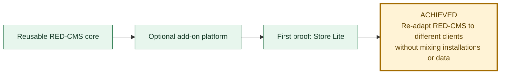

# RED-CMS 5.1 And Store Lite Progress

Last updated: 2026-08-23 after the published `v5.1.0` release, completed Store
Lite basic-demo proof, completed Stripe payment-adapter work through the D4C
network-disabled no-contact rehearsal, the owner's deferral of D4D real
Sandbox contact, the Colombia C0 Wompi/Nequi provider decision, the C1
provider-neutral initiation-mode contract, and the external C2 Wompi package
skeleton at commit `e17a371`, the C3A closed non-executing core Wompi profile,
the C3B exact disposable install/database/registrar proof, the C3C1 exact
body-signed ingress plus atomic-enable rehearsal, and the C3C2 two-client
isolation proof, plus the documentation-only C4A official Wompi readiness
audit, the C4B1 merchant-contract preflight, the C4B2 presentation/consent/
transient-wire package, and the C4B3 response-containment package plus exact
core adoption.

This is the canonical graphical status page for the current RED-CMS 5.1
objective. Green work is complete, blue is the active gate, orange is
owner-deferred, gray remains gated, and gold marks an achieved release target.

## Objective

The non-negotiable boundary is unchanged: each client keeps a separate RED-CMS
installation, database, add-on state, settings, secrets, media, and business
data. Store Lite is an optional package, never a core component or shared
client database.

## Store Lite launch path

```mermaid
flowchart TD
    A["COMPLETE<br/>A. Add-on platform foundation<br/>trust, lifecycle, runtime, permissions, transactions"]
    B["COMPLETE<br/>B. Product system<br/>simple products + bounded variants"]
    C["COMPLETE<br/>C. Catalog administration<br/>create, edit, save, permissions"]
    D["COMPLETE<br/>D. Public Product component<br/>homepage placement + responsive rendering"]
    E["COMPLETE<br/>E. Server-authoritative cart engine<br/>resolver + persistence"]
    F["COMPLETE<br/>Gate 2D1<br/>Store Lite bound to core atomic mutation runner"]
    G1["COMPLETE<br/>Gate 2D2A<br/>Core-owned accessible form model + escaped renderer"]
    G2["COMPLETE<br/>Gate 2D2B<br/>Store Lite product/variant field model"]
    G3["COMPLETE<br/>Gate 2D2C<br/>subject + CSRF + idempotency bootstrap"]
    G4A["COMPLETE<br/>Gate 2D2D1<br/>component mutation-presentation boundary"]
    G4B["COMPLETE<br/>Gate 2D2D2<br/>Store Lite Product binding + core form integration"]
    G4C1["COMPLETE<br/>Gate 2D2D3A<br/>unlinked browser controller"]
    G4C2["COMPLETE<br/>Gate 2D2D3B<br/>response/cookie ownership + endpoint wiring"]
    G4C3["COMPLETE — Gate 2D2D3C<br/>real Store Lite desktop/mobile mutation QA"]
    H1["COMPLETE<br/>Read-only Cart component<br/>empty + current subject lines"]
    H2A["COMPLETE<br/>Editable Cart A<br/>Store Lite quantity/remove data models"]
    H2B["COMPLETE<br/>Editable Cart B<br/>core bounded row-form retention"]
    H2C["COMPLETE<br/>Editable Cart C<br/>read-model binding + core composition"]
    H2D["COMPLETE<br/>Editable Cart D<br/>desktop/mobile mutation QA"]
    I1["COMPLETE<br/>Guest order foundation<br/>immutable server-derived snapshot"]
    I2["COMPLETE<br/>Store Lite 0.1.27<br/>guest-checkout scalar + presentation contract"]
    I3["COMPLETE<br/>Generic runtime-settings boundary<br/>declared non-secret handler configuration"]
    I4["COMPLETE<br/>Store Lite 0.1.28 guest checkout<br/>orders + pay on receipt + browser QA"]
    J1["COMPLETE — Release A<br/>read-only operational-package evidence"]
    J2["COMPLETE — Release B<br/>atomic enable + disable/re-enable"]
    J3A["COMPLETE — Release C1<br/>generic upgrade + failure recovery"]
    J3B["COMPLETE — Release C2<br/>real Store Lite 0.1.28 → 0.1.29 migration"]
    J3C["COMPLETE — Release C3<br/>responsive QA + configured-primary<br/>and two-client isolation"]
    K1["COMPLETE<br/>shared-host direct-PHP ingress adapter"]
    K2["COMPLETE<br/>real Apache/FastCGI proof + deployment review"]
    K3["COMPLETE<br/>basic demo deployment"]
    L["ACHIEVED<br/>Store Lite v1 usable on demo.red-sphere.com"]

    A --> B --> C --> D --> E --> F --> G1 --> G2 --> G3 --> G4A --> G4B --> G4C1 --> G4C2 --> G4C3 --> H1 --> H2A --> H2B --> H2C --> H2D --> I1 --> I2 --> I3 --> I4 --> J1 --> J2 --> J3A --> J3B --> J3C --> K1 --> K2 --> K3 --> L

    classDef complete fill:#e7f6ed,stroke:#27764a,color:#183d2a;
    classDef target fill:#fff3d6,stroke:#a36b00,color:#5e4100,stroke-width:3px;
    class A,B,C,D,E,F,G1,G2,G3,G4A,G4B,G4C1,G4C2,G4C3,H1,H2A,H2B,H2C,H2D,I1,I2,I3,I4,J1,J2,J3A,J3B,J3C,K1,K2,K3 complete;
    class L target;
```

## Current phase

| Question | Current answer |
| --- | --- |
| Where are we? | The Store Lite v1 basic-demo target is achieved. Release C3, the direct-PHP adapter, hosted Store Lite 0.1.31 deployment, responsive public verification, and RED-CMS 5.1 Basic instructions are complete. |
| What just finished? | Colombia C4B3 publishes Wompi package 0.1.3 at `277760e`: strict bounded create/lookup response containment bound to C4B2 wire/create evidence, with personal/provider detail discarded and every payment/order effect false. Exact core adoption and disposable proofs pass with no runtime change. |
| What is active now? | No required gate remains inside the Store Lite v1 basic-demo target. RED-CMS 5.1.0 is formally released. Stripe D4D is owner-deferred. Colombia C4B4 is next: one-attempt authorization/claim/state around the existing contained contracts, still credential-free/no-contact. |
| What can the demo do today? | Administrators can create/edit products, place Product and Cart components, and review Products and Orders tools. Public visitors can add, update, and remove simple or bounded-variable products, then use the guest-checkout form with pickup or delivery and pay on receipt. |
| What remains inside Gate 2D2? | Nothing. Gate 2D2 is closed by the supported-server Store Lite browser evidence. |
| What remains after this gate? | Nothing required for the basic-demo target. Stripe D4D may be resumed later through its existing approval ladder. C4B4 one-attempt authority/claim/state plus later CLI, transport-double, and disposable no-contact gates remain before C4C owner account/read-only retrieval. C4D one approved Sandbox transaction, C4E declined/event/rotation, and C5 deployment retain separate approval. |
| What is intentionally outside this target? | Hosted payment adapters and Events Calendar, Appointments, Donations, and Restaurant Ordering. Those remain separate later packages or gates. |

The hosted closeout evidence and explicit no-order-submission limitation are
recorded in
[`STORE-LITE-DEMO-CLOSEOUT-20260815.md`](STORE-LITE-DEMO-CLOSEOUT-20260815.md).

## Optional Site Search path

Site Search `0.1.3` is now built and exercised locally as a separately
distributed cross-cutting package. The RED-CMS core contains only the generic
`read_only_public_utility` activation and early exact-GET routing prerequisites.
The package owns its InnoDB/FULLTEXT index, query service/route, rebuild command,
responsive AJAX assets, and the `content.index-sync` service. Canonical Article
create, update, delete, restore, and move endpoints now issue bounded
best-effort post-commit refreshes; disposable lifecycle proof covers every one
of those index transitions. Install, enable, rebuild, JSON, desktop/mobile, and
incremental synchronization checks pass locally. It is not published,
deployed, or enabled for any retained client. The package now shares one
hierarchy-aware eligibility query between incremental and full rebuilds and
adds an Owner-gated, exact-confirmation, advisory-locked scheduled CLI repair
mode. Disposable proof covers inactive/active hierarchy, future start,
expiration, concurrent-run refusal, and a 50,000-document atomic rebuild with
20 real searches at 125.19 ms local p95 and 128.62 ms maximum. A Store Lite
0.1.36 typed source now supplies bounded public Product placement documents
without exposing commercial, cart, order, payment, customer, administrator,
setting, secret, or database facts; the two-package lifecycle passes 16
assertions. Private GitHub publication, release-archive browser/HTTP QA, and a
first client release remain separate gates. The package has
been extracted to an independent unpublished local Git repository. See
[`SITE-SEARCH-DIRECTION.md`](SITE-SEARCH-DIRECTION.md).

## Optional payment-adapter path

```mermaid
flowchart LR
    P0["COMPLETE<br/>P0. Provider-neutral contract<br/>events, secrets, replay, refunds"]
    P1["COMPLETE<br/>P1. Stripe Checkout candidate<br/>USD hosted-card pilot"]
    P2["COMPLETE<br/>P2. Non-network adapter fixture<br/>no provider account or charge"]
    A1["COMPLETE<br/>P3A-1. Closed manifest profile"]
    A2["COMPLETE<br/>P3A-2. Database readiness"]
    A3["COMPLETE<br/>P3A-3. Registrar validation"]
    A4["COMPLETE<br/>P3A-4. Closed raw event ingress"]
    A5["COMPLETE<br/>P3A-5. Atomic enablement<br/>closed core runner"]
    P3B["COMPLETE<br/>P3B. Store Lite event service<br/>through 0.1.35 lifecycle proof"]
    P3C["COMPLETE<br/>P3C. External Stripe adapter<br/>through 0.1.4 read-only profile"]
    P3D["COMPLETE<br/>P3D. Offline lifecycle + typed invocation"]
    P3E8["COMPLETE<br/>P3E-8. One read-only Sandbox GET<br/>key expired after evidence"]
    P3E9A["COMPLETE<br/>P3E-9A. Non-executing<br/>Checkout-creation contract"]
    P3E9B["COMPLETE<br/>P3E-9B. Synthetic package/core<br/>integration"]
    P3E9C1["COMPLETE<br/>P3E-9C1. Mutation-specific<br/>authorization recorded"]
    P3E9C2["COMPLETE<br/>P3E-9C2. One-attempt<br/>claim recorded"]
    P3E9C3A["COMPLETE<br/>P3E-9C3A. Transport-double<br/>start and result"]
    P3E9C3B1["COMPLETE<br/>P3E-9C3B1. CLI operator<br/>command contract"]
    P3E9C3B2["COMPLETE<br/>P3E-9C3B2. Disposable<br/>apply rehearsal"]
    P3E9D0["COMPLETE<br/>P3E-9D0. Pure real-POST<br/>preflight"]
    P3E9D1["COMPLETE<br/>P3E-9D1. External adapter<br/>0.1.7 preflight adoption"]
    P3E9D2["COMPLETE<br/>P3E-9D2. Core response<br/>containment + identities"]
    P3E9D3A["COMPLETE<br/>P3E-9D3A. CLI-only<br/>operator command"]
    P3E9D3B["COMPLETE<br/>P3E-9D3B. Disposable<br/>no-contact rehearsal"]
    P3E9D4A["COMPLETE<br/>P3E-9D4A. External provider-write<br/>operation, no Stripe contact"]
    P3E9D4B["COMPLETE<br/>P3E-9D4B. Durable core<br/>runner, in-memory acceptance"]
    P3E9D4C["COMPLETE<br/>P3E-9D4C. CLI command<br/>+ no-contact rehearsal"]
    P3E9D4D["OWNER-DEFERRED<br/>P3E-9D4D. One real Sandbox<br/>Session POST"]
    P4["GATED<br/>P4. Client deployment review<br/>explicit production approval"]
    CO0["COMPLETE<br/>Colombia C0. Wompi provider<br/>+ Nequi/COP decision"]
    CO1["COMPLETE<br/>Colombia C1. Initiation modes<br/>+ 55-assertion offline fixture"]
    CO2["COMPLETE<br/>Colombia C2. External package<br/>94 assertions + commit e17a371"]
    CO3A["COMPLETE<br/>Colombia C3A. Closed core<br/>Wompi manifest profile"]
    CO3B["COMPLETE<br/>Colombia C3B. Disposable<br/>database + registrar proof"]
    CO3C1["COMPLETE<br/>Colombia C3C1. Body ingress<br/>+ atomic enablement"]
    CO3C2["COMPLETE<br/>Colombia C3C2. Two-client<br/>enable/disable isolation"]
    CO4A["COMPLETE<br/>Colombia C4A. Official contract<br/>+ readiness audit"]
    CO4B1["COMPLETE<br/>Colombia C4B1. Merchant contracts<br/>+ exact core adoption"]
    CO4B2["COMPLETE<br/>Colombia C4B2. Two-contract consent<br/>+ transient wire/signature"]
    CO4B3["COMPLETE<br/>Colombia C4B3. Create/lookup<br/>response containment"]
    CO4B4["ACTIVE<br/>Later C4B. Attempt authority/state<br/>+ CLI, doubles, rehearsal"]
    CO4C["OWNER-GATED<br/>Colombia C4C-E. Account/read-only GET<br/>then separately approved Sandbox effects"]
    CO5["GATED<br/>Colombia C5. Demo<br/>deployment review"]

    P0 --> P1 --> P2 --> A1 --> A2 --> A3 --> A4 --> A5 --> P3B --> P3C --> P3D --> P3E8 --> P3E9A --> P3E9B --> P3E9C1 --> P3E9C2 --> P3E9C3A --> P3E9C3B1 --> P3E9C3B2 --> P3E9D0 --> P3E9D1 --> P3E9D2 --> P3E9D3A --> P3E9D3B --> P3E9D4A --> P3E9D4B --> P3E9D4C --> P3E9D4D --> P4
    P0 --> CO0 --> CO1 --> CO2 --> CO3A --> CO3B --> CO3C1 --> CO3C2 --> CO4A --> CO4B1 --> CO4B2 --> CO4B3 --> CO4B4 --> CO4C --> CO5

    classDef complete fill:#e7f6ed,stroke:#27764a,color:#183d2a;
    classDef active fill:#e7f0ff,stroke:#315f9d,color:#1f3f6a,stroke-width:3px;
    classDef deferred fill:#fff7e6,stroke:#a36b00,color:#5e4100;
    classDef gated fill:#eef1f5,stroke:#697684,color:#26323d;
    class P0,P1,P2,A1,A2,A3,A4,A5,P3B,P3C,P3D,P3E8,P3E9A,P3E9B,P3E9C1,P3E9C2,P3E9C3A,P3E9C3B1,P3E9C3B2,P3E9D0,P3E9D1,P3E9D2,P3E9D3A,P3E9D3B,P3E9D4A,P3E9D4B,P3E9D4C,CO0,CO1,CO2,CO3A,CO3B,CO3C1,CO3C2,CO4A,CO4B1,CO4B2,CO4B3 complete;
    class CO4B4 active;
    class P3E9D4D,CO4C deferred;
    class P4,CO5 gated;
```

Gates P0 through P2 define no credentials, webhook, checkout, charge, order
change, package, or database. P2 is a CLI-only contract fixture, not a payment
integration. Read the provider-neutral contract in
[`PAYMENT-ADAPTER-DIRECTION.md`](PAYMENT-ADAPTER-DIRECTION.md) and the
reversible USD pilot decision in
[`PAYMENT-ADAPTER-P1-DECISION.md`](PAYMENT-ADAPTER-P1-DECISION.md), then the
P2 fixture record in
[`PAYMENT-ADAPTER-P2-FIXTURE.md`](PAYMENT-ADAPTER-P2-FIXTURE.md), before
implementing the five-part P3 plan in
[`PAYMENT-ADAPTER-P3-SANDBOX-PROPOSAL.md`](PAYMENT-ADAPTER-P3-SANDBOX-PROPOSAL.md).
P3 is in progress: its core profile, Store Lite transition service, external
adapter, offline rehearsal, and first read-only Sandbox contact are complete.
Checkout creation and the remaining payment/webhook proof stay separately
gated.
P3A-1 supplies the data-only adapter profile and server-signature route
vocabulary. P3A-2 adds read-only Owner, same-database Store Lite dependency,
immutable migration-ledger, and InnoDB table evidence. P3A-3 refreshes those
facts and proves exact registration of one adapter and one non-routable
server-event handler without invoking either callback or publishing runtime.
P3A-4 adds only a closed unlinked raw-body/signature capture contract for a
future adapter verifier; it does not read a live request, verify a signature,
parse JSON, expose a route, or contact Stripe. P3A-5 adds the separate
dry-run-first, Owner-authorized, backup-bound atomic runner; it proves exact
stored settings and opaque secret-reference availability, repeats the full P3A
plan under locks, and commits only the enabled state plus a value-free audit
fact. It invokes no handler, resolves no secret bytes, exposes no endpoint, and
contacts no provider. P3B then adds only Store Lite-owned provider-neutral
transition, history, transactional-service, and lifecycle-rehearsal layers in
versions 0.1.32 through 0.1.35. P3A through P3D are complete. P3E-8 then proved
the first real provider contact through one read-only resource-miss GET in a
dedicated blank Stripe Sandbox. The request authorized no mutation or retry,
and its restricted key was expired after evidence review. P3E-9A then added
only a pure source contract in the external adapter repository; installable
adapter `0.1.4` remained unchanged. P3E-9B then advanced the external package
to `0.1.5` and added the matching non-persistent core runner, still with no
network or provider mutation. P3E-9C1 then records only a new mutation-specific
authorization and value-free audit after fresh database-backed authority and
package checks. P3E-9C2 then consumes only that exact authorization into one
immutable claim plus one value-free audit. P3E-9C3A then records start/result
around only a core-owned transport double; every real effect remains false.
P3E-9C3B1 adds the CLI dry-run-first command, and P3E-9C3B2 completes its
disposable apply rehearsal with zero provider effects and exact cleanup.
P3E-9D0 defines the pure future POST request. P3E-9D1 completes corrected
external adapter `0.1.7`, and P3E-9D2 contains only its non-executing typed
preflight result plus non-persistent identity hashes. P3E-9D3A adds its
CLI-only dry-run-first command contract. P3E-9D3B completes the disposable
no-contact rehearsal with zero provider effects and exact cleanup. P3E-9D4A
then completes external adapter `0.1.8` without provider contact and repair
`44ed7b3` restores package integrity. D4B durable core execution and D4C
operator/no-contact rehearsal are complete with real apply held at zero. The
owner deferred D4D; its approvals and evidence remain available for a later
resumption. Colombia C0 now selects a separate Wompi adapter with only Nequi
and COP in its initial scope. C1 adds only a closed provider-neutral
out-of-band initiation mode plus a 55-assertion offline fixture. C2 is the
separately distributed 0.1.0 package at `e17a371`; its 94 assertions pass and
the former Stripe-only core profile refusal is closed by C3A's exact non-
executing Wompi profile. C3B completes exact disposable installation,
migrations, database evidence, and registrar-only execution. C3C1 completes
body-signed ingress plus atomic enablement. C3C2 completes two-client
enable/disable isolation, closing Colombia C3. C4A completes the dated official
Wompi readiness audit without account or provider API contact. C4B1 publishes
package `0.1.1` at `7e4f8cb` with pure merchant-contract planning/containment,
then passes exact core adoption and disposable single/two-client proofs. C4B2
publishes package `0.1.2` at `fdbf881` with exact presentation/consent and
transient wire/signature evidence, then passes the same exact adoption proofs.
C4B3 publishes package `0.1.3` at `277760e` with strict bounded create/lookup
response containment, then passes the same exact adoption proofs. C4B4 is the
active credential-free/no-contact one-attempt authority/state gate. C4C through
C4E remain owner-gated before account access, credential entry, or provider
contact.
Every write credential, real
network request, Checkout Session or Wompi transaction, payment, webhook,
browser flow, hosted-demo change, and client deployment remains stopped. See
[`PAYMENT-ADAPTER-P3E9-SANDBOX-CHECKOUT-CREATION-FRONTIER.md`](PAYMENT-ADAPTER-P3E9-SANDBOX-CHECKOUT-CREATION-FRONTIER.md).
The Colombia decision and ladder are in
[`PAYMENT-ADAPTER-COLOMBIA-C0-DECISION.md`](PAYMENT-ADAPTER-COLOMBIA-C0-DECISION.md).
The completed C1 contract is in
[`PAYMENT-ADAPTER-COLOMBIA-C1-INITIATION-CONTRACT.md`](PAYMENT-ADAPTER-COLOMBIA-C1-INITIATION-CONTRACT.md).
The external C2 package record is in
[`PAYMENT-ADAPTER-COLOMBIA-C2-PACKAGE.md`](PAYMENT-ADAPTER-COLOMBIA-C2-PACKAGE.md).
The completed C3A core profile is in
[`PAYMENT-ADAPTER-COLOMBIA-C3A-CORE-PROFILE.md`](PAYMENT-ADAPTER-COLOMBIA-C3A-CORE-PROFILE.md).
The completed C3B disposable proof is in
[`PAYMENT-ADAPTER-COLOMBIA-C3B-DISPOSABLE-LIFECYCLE.md`](PAYMENT-ADAPTER-COLOMBIA-C3B-DISPOSABLE-LIFECYCLE.md).
The completed C3C1 atomic enablement proof is in
[`PAYMENT-ADAPTER-COLOMBIA-C3C1-ATOMIC-ENABLEMENT.md`](PAYMENT-ADAPTER-COLOMBIA-C3C1-ATOMIC-ENABLEMENT.md).
The completed C3C2 isolation proof is in
[`PAYMENT-ADAPTER-COLOMBIA-C3C2-TWO-CLIENT-ISOLATION.md`](PAYMENT-ADAPTER-COLOMBIA-C3C2-TWO-CLIENT-ISOLATION.md).
The completed C4A official readiness audit is in
[`PAYMENT-ADAPTER-COLOMBIA-C4A-OFFICIAL-READINESS.md`](PAYMENT-ADAPTER-COLOMBIA-C4A-OFFICIAL-READINESS.md).
The completed C4B1 package/core adoption proof is in
[`PAYMENT-ADAPTER-COLOMBIA-C4B1-CORE-ADOPTION.md`](PAYMENT-ADAPTER-COLOMBIA-C4B1-CORE-ADOPTION.md).
The completed C4B2 package/core adoption proof is in
[`PAYMENT-ADAPTER-COLOMBIA-C4B2-CORE-ADOPTION.md`](PAYMENT-ADAPTER-COLOMBIA-C4B2-CORE-ADOPTION.md).
The completed C4B3 package/core adoption proof is in
[`PAYMENT-ADAPTER-COLOMBIA-C4B3-CORE-ADOPTION.md`](PAYMENT-ADAPTER-COLOMBIA-C4B3-CORE-ADOPTION.md).

## Status rule

A gate moves to complete only after its contract, focused checks, disposable
database proof, relevant desktop/mobile browser inspection, configured-primary
isolation, exact cleanup, documentation, and reviewed commit are all recorded.
