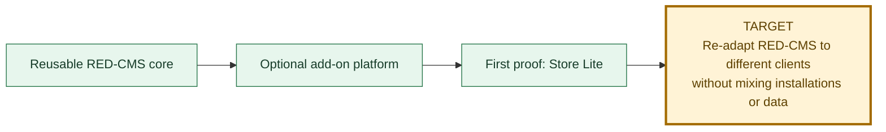

# RED-CMS 5.1 And Store Lite Progress

Last updated: 2026-08-12 after the generic disabled-package upgrade and
failure-recovery gate.

This is the canonical graphical status page for the current RED-CMS 5.1
objective. Green work is complete, blue is the active gate, gray remains
gated, and gold is the release target.

## Objective

The non-negotiable boundary is unchanged: each client keeps a separate RED-CMS
installation, database, add-on state, settings, secrets, media, and business
data. Store Lite is an optional package, never a core component or shared
client database.

## Store Lite launch path

```mermaid
flowchart TD
    A["COMPLETE<br/>A. Add-on platform foundation<br/>trust, lifecycle, runtime, permissions, transactions"]
    B["COMPLETE<br/>B. Product system<br/>simple products + bounded variants"]
    C["COMPLETE<br/>C. Catalog administration<br/>create, edit, save, permissions"]
    D["COMPLETE<br/>D. Public Product component<br/>homepage placement + responsive rendering"]
    E["COMPLETE<br/>E. Server-authoritative cart engine<br/>resolver + persistence"]
    F["COMPLETE<br/>Gate 2D1<br/>Store Lite bound to core atomic mutation runner"]
    G1["COMPLETE<br/>Gate 2D2A<br/>Core-owned accessible form model + escaped renderer"]
    G2["COMPLETE<br/>Gate 2D2B<br/>Store Lite product/variant field model"]
    G3["COMPLETE<br/>Gate 2D2C<br/>subject + CSRF + idempotency bootstrap"]
    G4A["COMPLETE<br/>Gate 2D2D1<br/>component mutation-presentation boundary"]
    G4B["COMPLETE<br/>Gate 2D2D2<br/>Store Lite Product binding + core form integration"]
    G4C1["COMPLETE<br/>Gate 2D2D3A<br/>unlinked browser controller"]
    G4C2["COMPLETE<br/>Gate 2D2D3B<br/>response/cookie ownership + endpoint wiring"]
    G4C3["COMPLETE — Gate 2D2D3C<br/>real Store Lite desktop/mobile mutation QA"]
    H1["COMPLETE<br/>Read-only Cart component<br/>empty + current subject lines"]
    H2A["COMPLETE<br/>Editable Cart A<br/>Store Lite quantity/remove data models"]
    H2B["COMPLETE<br/>Editable Cart B<br/>core bounded row-form retention"]
    H2C["COMPLETE<br/>Editable Cart C<br/>read-model binding + core composition"]
    H2D["COMPLETE<br/>Editable Cart D<br/>desktop/mobile mutation QA"]
    I1["COMPLETE<br/>Guest order foundation<br/>immutable server-derived snapshot"]
    I2["COMPLETE<br/>Store Lite 0.1.27<br/>guest-checkout scalar + presentation contract"]
    I3["COMPLETE<br/>Generic runtime-settings boundary<br/>declared non-secret handler configuration"]
    I4["COMPLETE<br/>Store Lite 0.1.28 guest checkout<br/>orders + pay on receipt + browser QA"]
    J1["COMPLETE — Release A<br/>read-only operational-package evidence"]
    J2["COMPLETE — Release B<br/>atomic enable + disable/re-enable"]
    J3A["COMPLETE — Release C1<br/>generic upgrade + failure recovery"]
    J3B["CURRENT — Release C2<br/>real Store Lite 0.1.28 → 0.1.29 migration"]
    J3C["REMAINING — Release C3<br/>responsive QA + configured-primary<br/>and two-client isolation"]
    K["TARGET<br/>Store Lite v1 usable on demo.red-sphere.com"]

    A --> B --> C --> D --> E --> F --> G1 --> G2 --> G3 --> G4A --> G4B --> G4C1 --> G4C2 --> G4C3 --> H1 --> H2A --> H2B --> H2C --> H2D --> I1 --> I2 --> I3 --> I4 --> J1 --> J2 --> J3A --> J3B --> J3C --> K

    classDef complete fill:#e7f6ed,stroke:#27764a,color:#183d2a;
    classDef current fill:#e8f1ff,stroke:#2f6fc3,color:#173a68,stroke-width:3px;
    classDef remaining fill:#f3f5f7,stroke:#82909c,color:#34424d;
    classDef target fill:#fff3d6,stroke:#a36b00,color:#5e4100,stroke-width:3px;
    class A,B,C,D,E,F,G1,G2,G3,G4A,G4B,G4C1,G4C2,G4C3,H1,H2A,H2B,H2C,H2D,I1,I2,I3,I4,J1,J2,J3A complete;
    class J3B current;
    class J3C remaining;
    class K target;
```

## Current phase

| Question | Current answer |
| --- | --- |
| Where are we? | Release C1 is complete. Core now has a dry-run-first, Owner-authorized disabled-package upgrade path with explicit recovery from partial MySQL DDL. |
| What just finished? | The generic 24-assertion gate requires a higher trusted same-type package, unchanged historical migrations, compatible stored settings, lifecycle/package locks, exact plan and backup confirmations, and zero runtime execution. Forced migration and completion-audit failures remained non-loadable as `upgrade_failed`; explicit resume applied only remaining migrations and preserved prior data/settings before committing the new identity disabled. |
| What is active now? | Release C2: create and rehearse a real Store Lite 0.1.28 → 0.1.29 append-only migration using this core boundary. |
| What can the demo do today? | In an isolated rehearsal, administrators can create/edit products and place Product and Cart components; public visitors can add, update, and remove simple or variable products and place a pickup or delivery order with pay on receipt. The hosted `demo.red-sphere.com` installation remains unchanged pending a separately reviewed deployment decision. |
| What remains inside Gate 2D2? | Nothing. Gate 2D2 is closed by the supported-server Store Lite browser evidence. |
| What remains after this gate? | Pass the real Store Lite upgrade, then responsive administrator/public, configured-primary, cleanup, and two-client isolation proof. A separately approved basic demo deployment may follow; hosted PayPal/card adapters remain later work. |
| What is intentionally outside this target? | Hosted payment adapters and Events Calendar, Appointments, Donations, and Restaurant Ordering. Those remain separate later packages or gates. |

## Status rule

A gate moves to complete only after its contract, focused checks, disposable
database proof, relevant desktop/mobile browser inspection, configured-primary
isolation, exact cleanup, documentation, and reviewed commit are all recorded.
