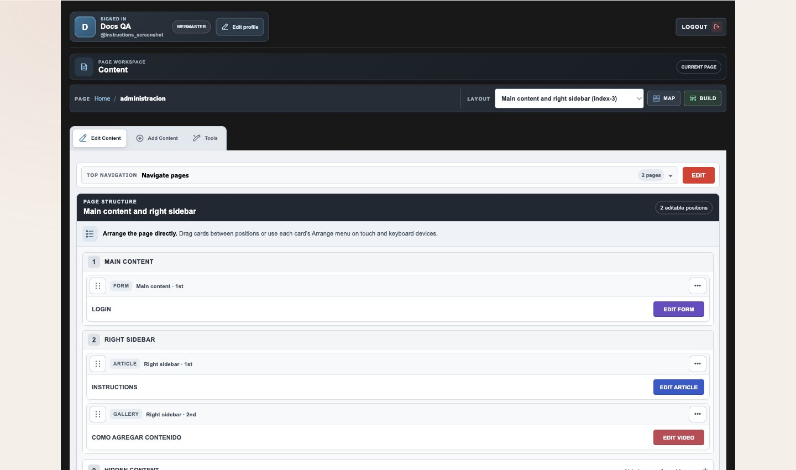
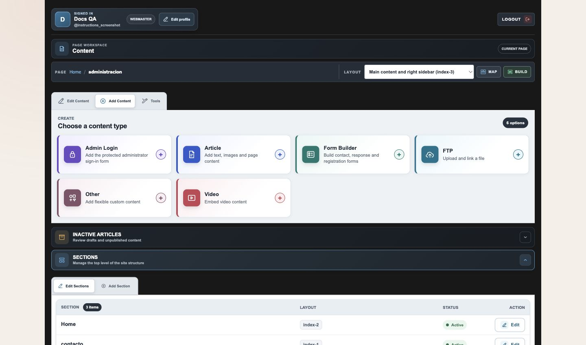
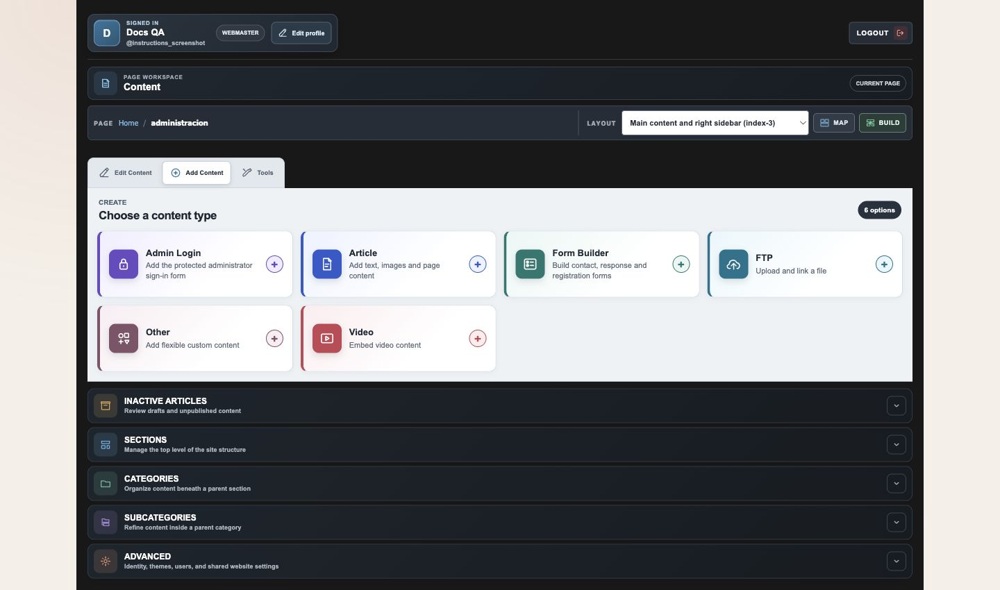
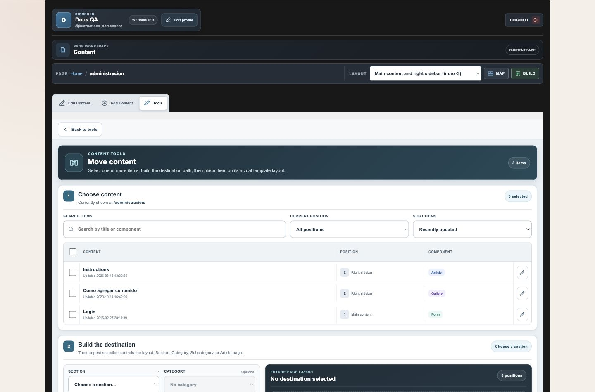

# RED-CMS 5.1 Core Administrator Guide

## Scope

This guide covers a raw, clean RED-CMS 5.1 installation: the portable PHP and MySQL CMS, its standard administrator workspace, content structure, navigation, layouts, media, and shared settings.

A clean 5.1 installation contains no store. Store Lite, products, carts, checkout, payment, and other business-specific capabilities are separately installed add-ons for one client at a time. They are intentionally outside this guide and outside the clean installer.

The administrator workspace is designed around three everyday questions:

1. What page am I editing? The page bar identifies the active route, its layout, and editable positions.
2. What belongs on this page? Edit Content exposes the assigned components, hidden content, and placement controls.
3. What should I do next? Add Content creates a core component, Tools moves existing content, and the lower panels manage the site structure and shared settings.

Public visitors do not see the administrator workspace. Themes control public presentation; administrator controls remain CMS-owned.

## Install the Clean Core

Follow [INSTALL.md](../INSTALL.md) for the authoritative installation procedure.

1. Start with an empty MySQL or compatible MariaDB database and a database user limited to that database.
2. Import `db-structure.sql`.
3. Copy `includes/config.local.example.php` to `includes/config.local.php` and set the local database host, port, name, user, and password.
4. Run the pending database migrations.
5. Replace the disabled starter administrator password hashes before the first login.
6. Serve the project, open `/admin/`, and verify the site URL, administrator identity, email configuration, media-upload permissions, and HTTPS.

Keep `includes/config.local.php` out of Git and release archives. Do not import `db-structure.sql` over an existing site. Back up the database and uploaded media, then prove that backup with a disposable restore before a release or structural change.

## First Login and Workspace

After signing in, confirm the signed-in account and use the page breadcrumb or Navigate pages to select the route to manage. Check the active layout before placing content. The workspace has Edit Content, Add Content, Tools, and the structure and Advanced panels.

Use Edit Content to edit or arrange existing components. Use Add Content only when the page needs a new core component. Use Tools → Move when content already exists but belongs elsewhere.

## Pages, Structure, and Navigation

RED-CMS organizes a site as Sections, optional Categories and Subcategories, and Articles. An Article can be a public page and can also hold placed content.

Create the parent path first. Then create the Article with a clear title, alias, correct layout, and active state when it is ready for visitors. Keep the hierarchy shallow and intentional because it determines the public path and the layouts available to that part of the site.

Use Top Navigation to control the labels, order, and links visitors see. A public page can remain outside navigation when it is meant to be reached only through a direct link.

## Add and Place Core Content

From the page being edited, open Add Content and choose the core type that matches the task. The available cards reflect the current page and account permissions. A clean core installation provides CMS content such as Articles, Form Builder, FTP, Other, Video, and supported Gallery tools. It does not provide Product, Cart, Checkout, or store controls.

Open Edit Content to see layout positions and assigned components. Drag cards between positions on desktop, or use the Arrange menu on touch and keyboard devices. Use Hidden Content when work must stay out of the public page until it is ready. After changing a layout or placement, inspect the public page on desktop and mobile.

## Move Existing Content

Use Tools → Move when an existing component belongs on another page or position. Select the content, choose the destination path, and choose a real position in that destination layout. The tool changes placement; it does not duplicate the component. Unrelated placements and order values remain intact.

## Advanced and Safe Maintenance

Advanced contains shared controls: administrator users, themes, Layout Builder, website identity, header and footer content, and Website CSS. Permissions determine what each administrator may change. Preview public-facing changes before release.

For ordinary content work, verify the public route, navigation, layout, images, and mobile presentation after saving. Use content version history where it is available instead of manually rebuilding an earlier revision.

For releases, migrations, or major cleanups, work from a backup and test on a disposable restored copy first. Existing sites own their data and may have client-specific add-ons, content, and media; no generic documentation migration should overwrite them.

## Instruction Article Source and Existing Sites

The clean installer seeds the core-only Instructions Article from `db-structure.sql`, and the four screenshots live in `admin/images/red-cms-instructions-manual_files/`. The selected-article preview is protected by exact content and media canaries in `includes/theme_preview_instructions_helpers.php`.

That installer seed affects new clean installations only. Update an existing client's Instructions Article through that site's administrator editor after review; do not add a migration that overwrites a potentially customized client guide.
